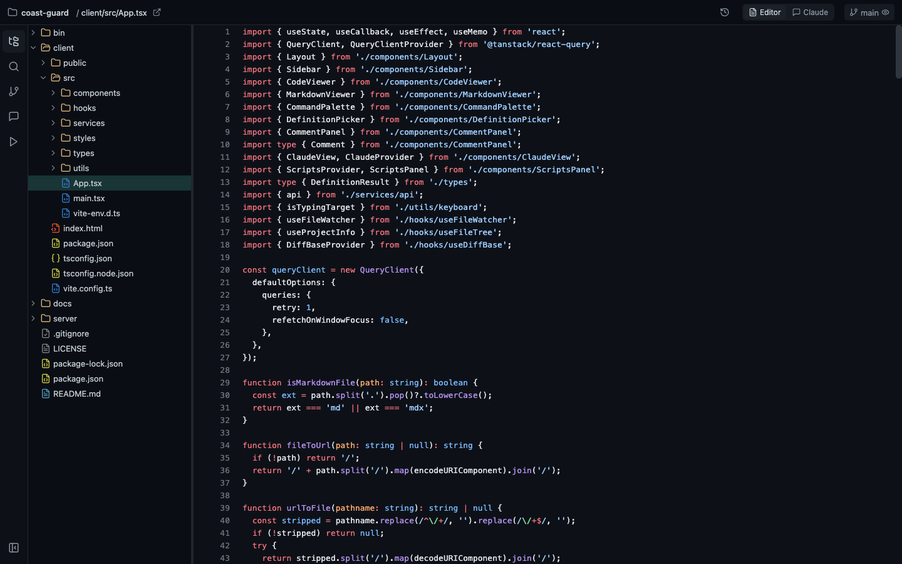
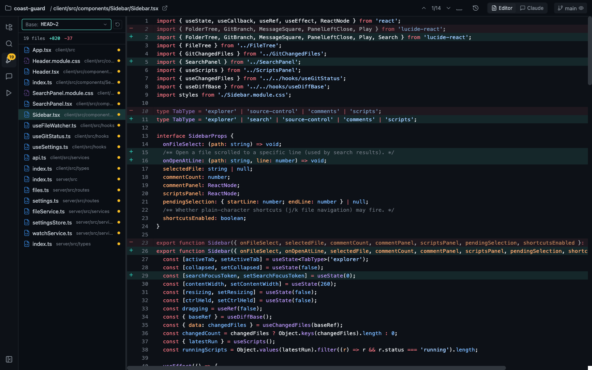
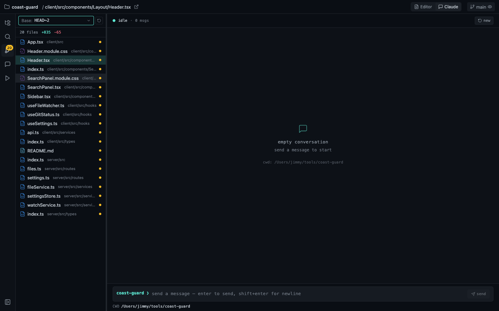
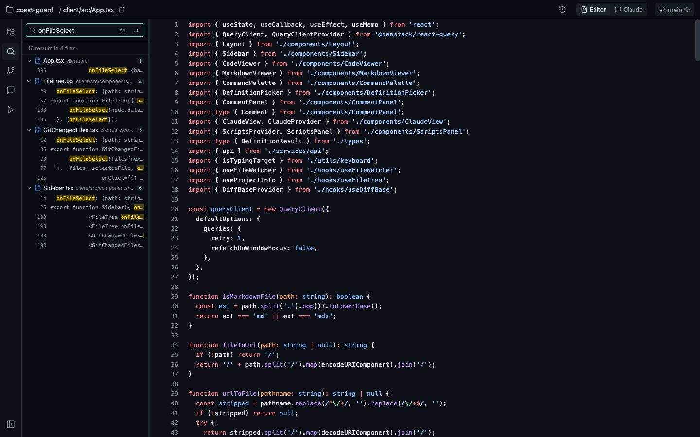
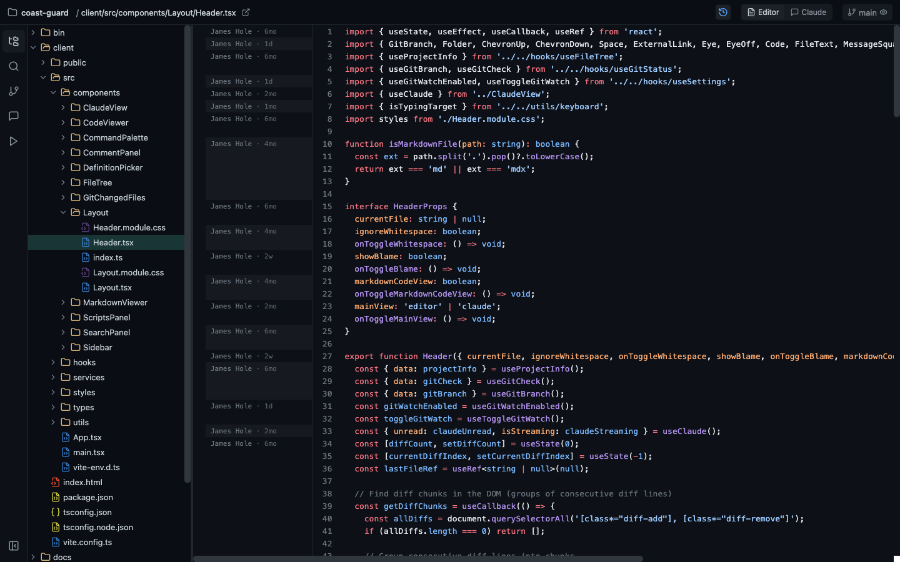

# 🏖️ Coast Guard

A lightweight, browser-based code viewer for reading code and reviewing local git changes. Point it at any project directory and it serves a fast, keyboard-driven UI with a file explorer, full-text search, syntax highlighting, git diff visualization, git blame, markdown rendering, inline review comments, an npm script runner, and an optional embedded Claude chat.

It runs entirely on your machine — a small Express server reads your local filesystem and git repo, and a React single-page app renders it in the browser.



## Features

- **File explorer** — browse the project tree (including dot-prefixed files and directories); open any file with syntax highlighting (powered by [Shiki](https://shiki.style/), GitHub Dark theme, 20+ languages).
- **Full-text search** — find a string or regex across every file in the project (`Cmd/Ctrl+Shift+F`), with case-sensitivity and regex toggles; results are grouped by file and click through to the matching line. Hidden/dot files are included; `.gitignore`d files are not.
- **Source control view** — see modified, staged, and untracked files grouped by status, with aggregate diff stats.
- **Git diff visualization** — inline additions/deletions rendered in the code viewer, with whitespace-ignoring toggle and hunk-to-hunk navigation.
- **Git blame** — a toggleable blame column (`b`) with sticky hunk labels, commit tooltips on hover, drag-to-resize, and links to the commit on GitHub.
- **Diff base picker** — diff the working tree against `HEAD`, a branch's merge base, another branch, or any custom ref (e.g. `HEAD~3`, `origin/main`).
- **Markdown rendering** — GitHub-flavored markdown with a rendered/raw toggle; checkboxes are clickable and write back to the file, and rendered code blocks have a copy button.
- **Review comments** — drag across line numbers to select a range and attach inline comments; copy them all out or hand them to the embedded Claude chat.
- **Go to definition** — `Cmd/Ctrl`-click a TypeScript symbol to jump to its definition (with a picker when there are multiple).
- **Command palette** — fuzzy file search with smart ranking (`Cmd/Ctrl+K`).
- **Scripts panel** — run the `npm` scripts defined in the project's `package.json` from the UI, with live streaming output, stop control, and pinning.
- **Live file watching** — the UI updates over a WebSocket as files change on disk; git polling can be toggled on/off from the branch chip in the header.
- **Embedded Claude chat** — an optional in-browser chat backed by the local `claude` CLI (see the [usage & billing note](#-embedded-claude-chat--usage--billing)).

## Screenshots

| Git diff visualization | Embedded Claude chat |
| --- | --- |
|  |  |

| Full-text search | Git blame |
| --- | --- |
|  |  |

## Requirements

- **Node.js 18+** (ESM, uses the workspaces feature)
- **npm** (the repo is an npm workspaces monorepo)
- **git** on your `PATH` (the source-control features shell out to git)
- The **[`claude` CLI](https://docs.claude.com/en/docs/claude-code/overview)** — only required if you use the embedded Claude chat

## Installation

```bash
git clone https://github.com/jameshole/coast-guard.git
cd coast-guard
npm install
npm run build      # builds both the server and the client bundle
```

`npm run build` compiles the server (`server/dist`) and the client (`client/dist`) — the CLI serves the built output, so a build is required before `start`.

## Usage

Run it against the current directory:

```bash
npm start
# or, if you link/install the bin globally:
coast-guard
```

Or point it at any project:

```bash
coast-guard /path/to/your/project
coast-guard ~/code/my-app --port 4000
coast-guard . --no-open          # don't auto-open the browser
```

| Option | Default | Description |
| --- | --- | --- |
| `[path]` | `.` | Project directory to serve |
| `-p, --port <number>` | `3847` | Port to listen on (auto-increments if busy) |
| `--no-open` | — | Don't open the browser automatically |

The server opens `http://localhost:3847` by default. Press `Ctrl+C` to stop.

### Development

Run the server and client in watch mode (Vite dev server + `tsx watch`) instead of a production build:

```bash
npm run dev
```

## Keyboard shortcuts

| Shortcut | Action |
| --- | --- |
| `Cmd/Ctrl + K` | Open the command palette (fuzzy file search) |
| `Cmd/Ctrl + Shift + F` | Open the search tab and focus the query input |
| `Cmd/Ctrl + J` | Toggle between the Editor and Claude views |
| `Ctrl + 1` / `2` / `3` / `4` / `5` | Switch sidebar tab: Explorer / Search / Source Control / Comments / Scripts |
| `Ctrl + 0` | Collapse / expand the sidebar |
| `b` | Toggle the git blame column (in the open file) |
| `z` / `x` | Previous / next changed file (in the Source Control view) |
| `n` / `m` | Previous / next diff hunk (in the open file) |
| `Cmd/Ctrl + Click` | Go to definition (TypeScript) |

The single-character shortcuts (`b`, `z`, `x`, `n`, `m`) only fire in the Editor view and are suppressed while you're typing in an input or text area.

## 🤖 Embedded Claude chat — usage & billing

The embedded chat works by shelling out to the local `claude` CLI in headless mode (`claude -p …`), so it draws from whatever your CLI is signed in with — for subscription plans (Pro/Max/Team/Enterprise) it counts toward the **same usage limits as running Claude Code in your terminal**, and for API-key auth it bills at normal API rates.

> [!NOTE]
> In May 2026 Anthropic announced that Agent SDK / `claude -p` usage would move off subscription plans onto a separate, much smaller monthly credit allowance. That change was [paused on June 15, 2026 before it took effect](https://support.claude.com/en/articles/15036540-use-the-claude-agent-sdk-with-your-claude-plan) — headless usage still draws from your normal plan limits, and Anthropic says it will give advance notice before any future change. If billing behavior matters to you, check that article for the current policy.

If you don't need the chat, you can ignore it — the rest of Coast Guard works without the `claude` CLI installed.

### Security note

The chat invokes the CLI with `--permission-mode bypassPermissions`, so Claude runs with all tool permissions auto-approved (it can read, edit, and run commands in the served project without prompting). Only use it on projects you trust, and be aware of what you're asking it to do.

You can point Coast Guard at a specific CLI binary with the `CLAUDE_BIN` environment variable (defaults to `claude` on your `PATH`):

```bash
CLAUDE_BIN=/usr/local/bin/claude coast-guard .
```

## Architecture

```
coast-guard/
├── bin/coast-guard.js   # CLI entry (commander) — resolves the path, starts the server, opens the browser
├── server/              # Express + ws server: filesystem, git, scripts, and Claude routes
│   └── src/routes/      # git.ts, files.ts, scripts.ts, claude.ts
└── client/              # React + Vite single-page app
    └── src/components/  # FileTree, CodeViewer, GitChangedFiles, ClaudeView, ScriptsPanel, …
```

- **Server:** Node.js (ESM), Express, `ws` for the file-watching/script-output WebSocket, [`simple-git`](https://github.com/steveukx/git-js) + [`parse-git-diff`](https://github.com/JordanFinners/parse-git-diff) for git, [`chokidar`](https://github.com/paulmillr/chokidar) for watching, and the TypeScript compiler API for go-to-definition.
- **Client:** React 18, Vite, [Shiki](https://shiki.style/) for highlighting, [TanStack Query](https://tanstack.com/query) for data fetching, `react-arborist` for the tree, `react-markdown` + `remark-gfm` for markdown, CSS Modules for styling.

## License

Released under the [MIT License](LICENSE).
